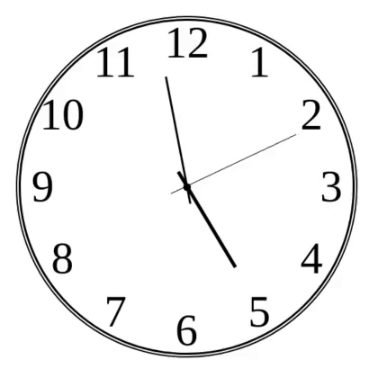

## Clockjs

A simple analog clock written in vanilla-js.

### Install instructions:
1. Clone this repository.
2. In the project folder:
	1. Run `yarn install (or npm install)` 
	2. Then `yarn dev (or npm run dev)` 
3. A browser window will open automatically.
